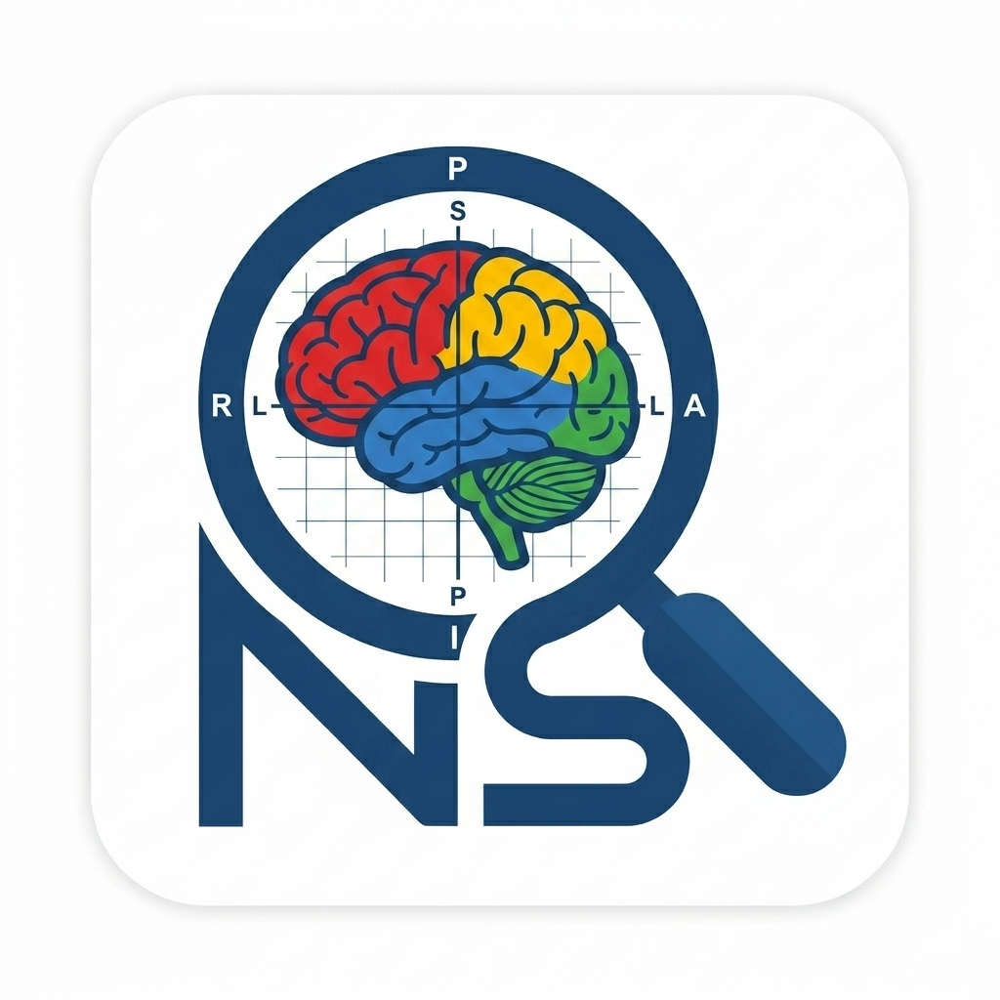

<div align="center">



# NiftiSpy

**High-performance NIfTI medical image viewer for VS Code**

[](https://code.visualstudio.com/)
[](https://open-vsx.org/extension/maiwulanjiangmaiming/niftispy)
[](LICENSE)
[](https://github.com/MaiwulanjiangMaiming/NiftiSpy)

</div>

A blazing-fast NIfTI medical image viewer that runs entirely inside VS Code. Open `.nii`, `.nii.gz`, or `.hdr` files locally or from remote SSH servers — no external tools required.

---

## Features

| Feature | Description |
|---------|-------------|
| **Fast Loading** | Native `DecompressionStream` API, server-side preview extraction, progressive rendering |
| **Multi-Planar Views** | Axial, Coronal, Sagittal + 3D MIP with drag-to-rotate |
| **Side-by-Side Comparison** | Overlay and split-view modes with spatial coordinate mapping via sform/qform |
| **Orientation Labels** | Anatomical direction labels (R/L, A/P, S/I) derived from NIfTI header |
| **Window/Level** | Interactive contrast adjustment with auto-contrast |
| **Colormaps** | gray, hot, cool, viridis, jet, inferno |
| **Remote File Support** | Works with files on remote SSH servers via VS Code Remote |

---

## Installation

1. Install from the [VS Code Marketplace](https://marketplace.visualstudio.com/) (coming soon)
2. Or build from source:

```bash
git clone https://github.com/MaiwulanjiangMaiming/NiftiSpy.git
cd NiftiSpy
npm install
npm run build
```

Then press `F5` in VS Code to launch the Extension Development Host.

---

## Usage

1. Open any `.nii`, `.nii.gz`, or `.hdr` file in VS Code
2. The viewer opens automatically as a custom editor
3. Use **mouse wheel** to scroll slices, **drag** to pan, **Ctrl+Scroll** to zoom
4. Click the **maximize button** (A/C/S/M) on any view to expand it
5. Add a second image via **+ Add Image** to enable comparison modes

### Controls

| Action | Input |
|--------|-------|
| Scroll slices | Mouse wheel |
| Zoom | Ctrl + Scroll |
| Pan view | Drag |
| Set crosshair | Click |
| Maximize view | A / C / S / M buttons |
| Auto contrast | Auto button |
| Reset view | Reset button |

---

## Architecture

```
VS Code Extension Host
    └── NiiEditorProvider.ts  ──►  LocalFileProxy (HTTP server for remote files)
                                          │
    Webview Panel  ◄──────────────────────┘
        ├── viewer.ts         ──►  Canvas 2D rendering, UI interaction
        ├── worker.ts         ──►  NIfTI parsing, gzip decompression
        └── nii-parser.ts     ──►  Header parsing, orientation detection
```

---

## Acknowledgments

This project was built upon and inspired by the following open-source projects. We are deeply grateful for their excellent work:

- **[ITK-SNAP](http://www.itksnap.org/)** — An open-source software application for segmenting structures in 3D medical images. Our orientation handling, coordinate mapping (`voxelToWorld` / `worldToVoxel`), and anatomical direction label logic are based on ITK-SNAP's `ImageCoordinateGeometry` and `GenericSliceModel` implementations. Licensed under GPL.

- **[niivue](https://github.com/niivue/niivue)** — A lightweight web-based NIfTI viewer. Our NIfTI parsing approach and webview rendering architecture were inspired by niivue's design. Licensed under BSD-2-Clause.

---

## License

[MIT](LICENSE) © Maiwulanjiang Maiming
