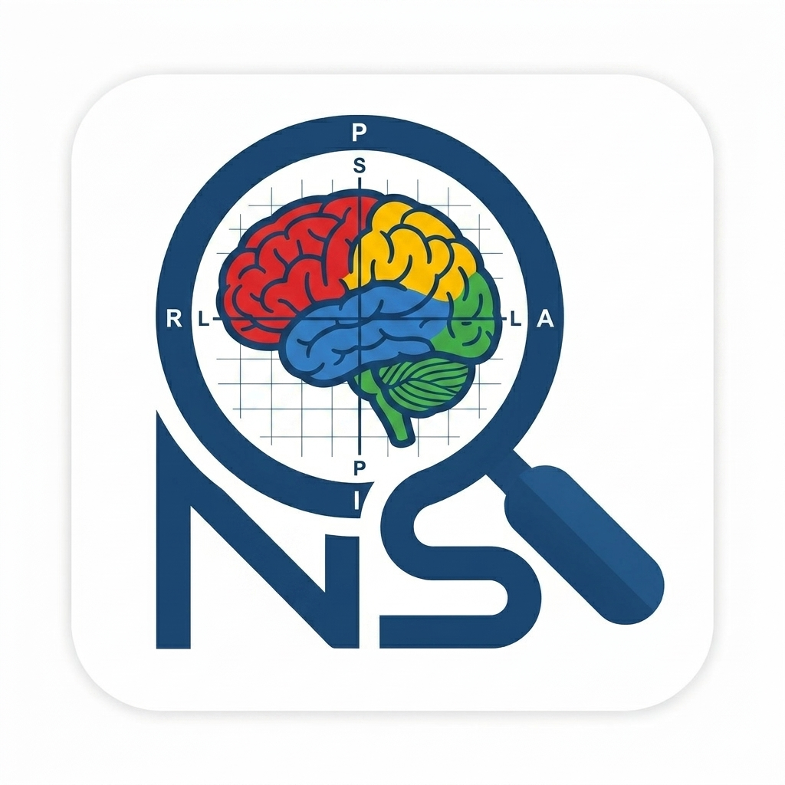

<div align="center">



# NiftiSpy

**High-performance NIfTI viewer for VS Code**

[](https://marketplace.visualstudio.com/items?itemName=MaiwulanjiangMaiming.niftispy)
[](https://open-vsx.org/extension/maiwulanjiangmaiming/niftispy)
[](LICENSE)
[](https://github.com/MaiwulanjiangMaiming/NiftiSpy)

</div>

Open `.nii`, `.nii.gz`, and `.hdr` volumes directly inside VS Code. The extension is optimized for both local files and VS Code Remote / SSH workflows, with fast preview-first loading, worker-based decoding, slice-on-demand fetches, and optional native acceleration.

## Highlights

- Fast initial preview for large volumes
- Axial, coronal, sagittal, and 3D MIP views
- Remote-friendly loading through a local proxy
- Debounced full-volume loading to avoid slowdowns during rapid switching
- Canvas-first rendering for broad compatibility, with WebGL and WebGPU fast paths
- HTTP/2 multiplexed proxy for concurrent slice requests
- IndexedDB disk cache for remote file slices
- Progressive LOD loading for .nii.gz files
- GZIP random-access index for on-demand slice extraction
- Zarr v2 format support
- Optional Rust native acceleration (mmap, fast decompress)
- Window/level, zoom, pan, crosshair, orientation labels, and compare mode

## Supported Files

- `.nii`
- `.nii.gz`
- `.hdr`
- `.zarr` (Zarr v2 format)

## Zarr Support

NiftiSpy supports reading Zarr v2 directories for volumetric image data.

- **Supported formats**: Zarr v2 directories (`.zarr`)
- **Supported compressors**: zlib/gzip, blosc, lz4
- **How to open**: Double-click a `.zarr` directory in the VS Code file explorer
- **Limitations**: Read-only — no write support for Zarr volumes

## Install

### Marketplace

Search for **NiftiSpy** in the VS Code Extensions view.

### Open VSX

Install from [Open VSX](https://open-vsx.org/extension/maiwulanjiangmaiming/niftispy).

### From Source

```bash
git clone https://github.com/MaiwulanjiangMaiming/NiftiSpy.git
cd NiftiSpy
npm install
npm run build
```

Press `F5` in VS Code to launch the Extension Development Host.

## Optional Native Acceleration

The extension works without any native module. If you want the optional Rust fast path for hotspot parsing / extraction:

```bash
npm run build:native
```

This builds the Rust crate and copies the resulting binding to `native/index.node`.

## Usage

1. Open a `.nii`, `.nii.gz`, or `.hdr` file.
2. The custom viewer opens automatically.
3. Scroll to change slices.
4. Use `Ctrl + Scroll` to zoom.
5. Drag to pan when zoomed in.
6. Click to set the crosshair.
7. Use `+ Add Image` for overlay or side-by-side comparison.

### Controls

| Action | Input |
| --- | --- |
| Scroll slices | Mouse wheel |
| Zoom | `Ctrl + Scroll` |
| Pan | Drag |
| Set crosshair | Click |
| Maximize a view | `A / C / S / M` buttons |
| Auto contrast | `Auto` |
| Reset view | `Reset` |

## Loading Pipeline

NiftiSpy uses a preview-first pipeline so large images become viewable quickly before the full volume is ready:

1. The extension host opens the custom editor and sends viewer config to the webview.
2. Local and remote files are normalized through `LocalFileProxy` for preview extraction, slice endpoints, and caching.
3. The webview shows an initial preview using direct binary slice payloads or HTTP preview fallback.
4. Full-volume loading runs in workers and is debounced during rapid image switching.
5. Slice requests, cached volumes, and cleanup logic reduce repeated decode and transfer cost.

## Architecture

```text
VS Code Extension Host
  ├── extension.ts
  ├── NiiEditorProvider.ts
  ├── VolumeCache.ts
  └── LocalFileProxy.ts
        ├── /header
        ├── /preview
        ├── /preview-bin
        ├── /slice
        └── /file

Webview
  ├── viewer.ts
  ├── worker.ts
  └── nii-parser.ts

Optional Native Path
  ├── native/src/lib.rs
  └── src/nativeBridge.ts
```

## Configuration

The extension contributes these settings:

| Setting | Default | Description |
| --- | --- | --- |
| `niftispy.proxyPort` | `0` | HTTP proxy port, `0` means auto-assign |
| `niftispy.defaultColormap` | `gray` | Initial colormap |
| `niftispy.enableLOD` | `true` | Enables preview / LOD flow for gzip volumes |
| `niftispy.previewMode` | `binary` | Preview transport format |
| `niftispy.renderBackend` | `auto` | Slice renderer, `auto` selects best available |
| `niftispy.fullVolumePolicy` | `debounced` | When full-volume loading is triggered |
| `niftispy.nativeAcceleration` | `auto` | Native module policy |

## Development

### Build

```bash
npm run build
```

### Watch

```bash
npm run watch
```

### Tests

```bash
npm test
```

### Benchmarks

```bash
npm run bench:load
npm run bench:multi
npm run bench:remote
```

### Package

```bash
npm run package
```

## Repo Hygiene

- `native/target/` and `native/index.node` are ignored to keep the repository clean
- `.vscodeignore` excludes development-only assets from the VSIX package
- Native acceleration is optional, so source builds remain usable without Rust

## Version

- Current release: `2.1.2`

For release notes, see [CHANGELOG.md](CHANGELOG.md).

## Acknowledgments

This project was built upon and inspired by the following open-source projects. We are deeply grateful for their excellent work:

- **[ITK-SNAP](http://www.itksnap.org/)** — An open-source software application for segmenting structures in 3D medical images. Our orientation handling, coordinate mapping (`voxelToWorld` / `worldToVoxel`), and anatomical direction label logic are based on ITK-SNAP's `ImageCoordinateGeometry` and `GenericSliceModel` implementations. Licensed under GPL.

- **[niivue](https://github.com/niivue/niivue)** — A lightweight web-based NIfTI viewer. Our NIfTI parsing approach and webview rendering architecture were inspired by niivue's design. Licensed under BSD-2-Clause.

---

## License

[MIT](LICENSE) © Maiwulanjiang Maiming
